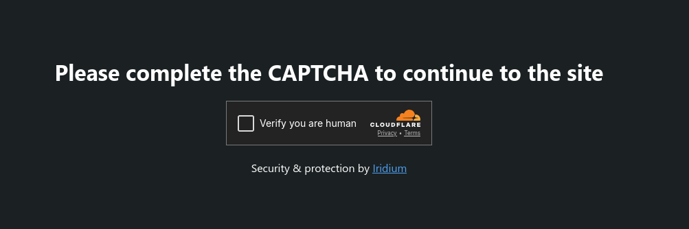

<div align="center">
  <h1>Iridium</h1>
  <p>A simple reverse proxy made in Go.</p>
</div>

## Features

- Configurable via YAML config files
- Supports HTTP
- Supports static responses, static files, and proxying to other servers
- Basic logging (to console and files)
- Uses raw TCP connections (no HTTP library)
- Lightweight and fast
- Has a built-in WAF (Web Application Firewall), configurable to block libraries (such as curl, wget, etc.), crawlers, specific IPs, and more.
  Even supports serving a captcha page for blocked requests.
- Edge caching support for static files: caches files in memory for faster delivery
- Compression support (gzip, deflate, zstd)
- Rate limiting support: limits the number of requests per IP per second

## Installation

As of now, there are no pre-built binaries available. You need to build it from source.

### Docker

You can build and run Iridium using Docker with the following commands:

```bash
docker build -t iridium .
docker run -d -p 8080:8080 --name iridium -v ./iridium-data:/root/.iridium iridium
```

### macOS

You can install Iridium on macOS using Homebrew:

```bash
brew install IridiumProxy/iridium/iridium
```

## Configuration

On first run (without a config file), default config files will be created in the `~/.iridium` directory (or `%APPDATA%\Iridium` on Windows). You can edit those files to customize the behavior of Iridium. The configuration is done in YAML format, which is easy to read and write.

By default, the config file is located at `~/.iridium/config.yaml` (or `%APPDATA%\Iridium\config.yaml` on Windows).

## Edge Caching

Iridium supports edge caching for static files. You can enable edge caching in the configuration file by setting the `edge_cache.enabled` option to `true`. This option can be applied globally or per host.

Because edge caching stores files in memory, make sure your server has enough RAM to handle the cached files.

> [!TIP] 
> When Edge Caching is enabled, Iridium will automatically add a `X-Cache: HIT` or a `X-Cache: MISS` header to the response, indicating whether the response was served from the cache or not.

### Caching Time

If not specified, the caching time will be taken from the `Cache-Control` header of the response. If the header is not present, a default caching time of 1 hour (3600 seconds) will be used.

This can be configured in the `edge_cache.default_cache_time` option in the configuration file (in seconds).

## WAF (Web Application Firewall)

Iridium has a built-in WAF that can be configured to block specific user agents, IPs, and more. You can configure the WAF in the `waf` section of the configuration file.

### Blocking User Agents

**Iridium can block requests based on the `User-Agent` header.**

> [!TIP]
> For simplicity, you can block pre-defined libraries, tools, and crawlers by using the `block_libraries` or `block_crawlers` options. The `block_empty_ua` option can be used to block requests with an empty `User-Agent` header.

### VPN/Proxy Blocking

Iridium can block requests from:
- known VPNs using the `block_vpns` option, 
- known public proxies using the `block_proxies` option, 
- known Tor exit nodes using the `block_tor` option.

These options use public lists to determine if an IP is a VPN, proxy, or Tor exit node.

### Blocking Specific IPs or Ranges

You can block specific IPs or ranges using the `blocked_ips` option. You can specify individual IPs (`1.2.3.4`) or CIDR ranges (`1.2.3.0/24`).

### Rate Limiting

To prevent abuse, you can enable rate limiting using the `rate_limit` option. This option limits the number of requests per IP per second. If an IP exceeds the limit, it will receive a `429 Too Many Requests` response.

### Blocked Responses

When a request is blocked by the WAF, by default, Iridium will return a `403 Forbidden` response.

#### Serving a Captcha

You can configure Iridium to serve a captcha page instead of a `403 Forbidden` response when a request is blocked. To do this, set the `waf.captcha.enabled` option to `true` in the configuration file.

To change the captcha provider, you can set the `waf.captcha.provider` option to `hcaptcha`, `recaptcha`, or `turnstile`.
You will also need to provide the site key and secret key for the captcha provider you choose. These can be set in the `waf.captcha.site_key` and `waf.captcha.secret_key` options, respectively.
That's all you need to do to enable captcha protection for blocked requests, Iridium will handle the rest!



When the captcha is successfully solved, the user will be allowed to access the requested resource, and a `iridium_clearance` cookie will be set to remember the user for future requests (for 30 minutes by default).

> [!NOTE]
> To protect from spoofing, the `iridium_clearance` cookie is tied to the user's IP address and User-Agent. If either of these change, the user will need to solve the captcha again.
> Also, the cookie is signed using AES-256 encryption to prevent tampering.